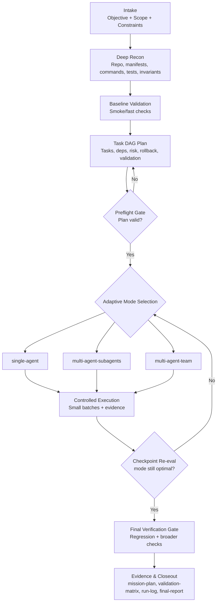

# Mission Ops

**Cross-Client End-to-End Execution Skill (Plan + Execute + Verify)**

Mission Ops is a single integrated skill for high-rigor software missions. It performs deep reconnaissance, creates a detailed execution plan, executes changes through controlled batches, applies strict verification gates, and produces evidence artifacts.

## Why Mission Ops

Use Mission Ops when you want:

- thorough planning and execution in one workflow
- high confidence and lower error rates
- strict validation and rollback discipline
- detailed final evidence and risk reporting

## Core Workflow

1. Intake and normalization
2. Deep reconnaissance
3. Baseline validation
4. Task DAG planning
5. Preflight gate
6. Adaptive execution mode selection
7. Controlled execution
8. Final verification gate
9. Evidence and closeout

## Adaptive Execution Modes

Mission Ops selects execution style after preflight and can re-evaluate at checkpoints:

- `single-agent`: sequential or tightly-coupled work with high shared-file overlap.
- `multi-agent-subagents`: parallel independent slices that converge through one coordinator.
- `multi-agent-team`: parallel interdependent work requiring explicit cross-task coordination.

Selection signals:

- parallelizable task count
- shared file overlap/conflict risk
- risk tier and independent review requirements
- expected coordination overhead vs throughput gain

Fallback behavior:

- Mission Ops automatically downgrades to `single-agent` if coordination overhead, conflict rate, or dependency drift outweighs parallel gains.

## Flow Diagram



## Output Artifacts

Cache base directory is selected in this order:

1. `.codex/`
2. `.claude/`
3. `.agent-cache/`

Artifacts:

- `mission-plan.md`
- `validation-matrix.json`
- `run-log.md`
- `final-report.md`

Template references:

- `references/mission-plan-template.md`
- `references/final-report-template.md`
- `references/validation-matrix-template.json`

## Installation

### Option A: Clone directly

#### Codex

```bash
git clone https://github.com/sandeepkv93/mission-ops.git ~/.codex/skills/mission-ops
```

#### Claude

```bash
git clone https://github.com/sandeepkv93/mission-ops.git ~/.claude/skills/mission-ops
```

### Option B: Install script

```bash
git clone https://github.com/sandeepkv93/mission-ops.git
cd mission-ops
./scripts/install.sh both
```

Targets:

- `./scripts/install.sh codex`
- `./scripts/install.sh claude`
- `./scripts/install.sh both`

Optional artifact bootstrap:

```bash
./scripts/bootstrap_artifacts.sh
```

## Usage

Invoke by skill name in your client:

- "Use mission-ops to complete this objective end-to-end"
- "Run mission-ops on scope=internal/auth with low risk tolerance"
- "Use mission-ops and choose the best execution mode automatically"

## Output Contract (Runtime)

Mission Ops final response includes:

- `Action`
- `Scope`
- `Execution mode`
- `Result`
- `Validation`
- `Confidence`
- `Open risks`
- `Next step`

## File Structure

```text
mission-ops/
├── SKILL.md
├── README.md
├── agents/
│   └── openai.yaml
├── references/
│   ├── gates-and-checklists.md
│   ├── mission-plan-template.md
│   ├── final-report-template.md
│   └── validation-matrix-template.json
└── scripts/
    ├── install.sh
    └── bootstrap_artifacts.sh
```

## Compatibility Notes

- `SKILL.md` is client-agnostic.
- `agents/openai.yaml` provides Codex/OpenAI metadata and does not prevent Claude usage.

## License

MIT License
